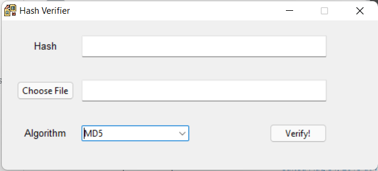
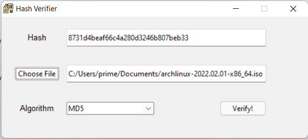
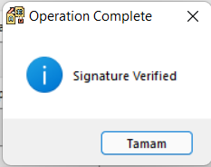

# Hash Verifier

**With this application, you can easily verify hashes without the need to download anything to the internet and without dealing with the command line.**


## Supported Algorithms:

1. _MD5_
2. _SHA1_
3. _SHA256_
3. _SHA384_
5. _SHA512_

***




### Executable File:

<a href="https://github.com/ne0-jamm3r/Hash-Verifier/raw/main/dist/hash_verifier.exe">hash_verifier.exe</a>
MD5 CheckSum: C68677619C7D1D758648FD02534DEE6C

---
#### Compiling from source code
```
pyinstaller --onefile -w hash_verifier.py 
```
Then copy-past icon file to next to exe file.
***
_Please fork me!_


